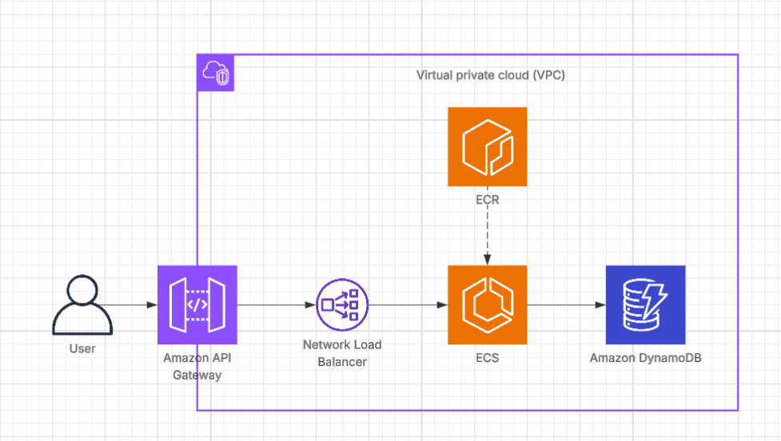
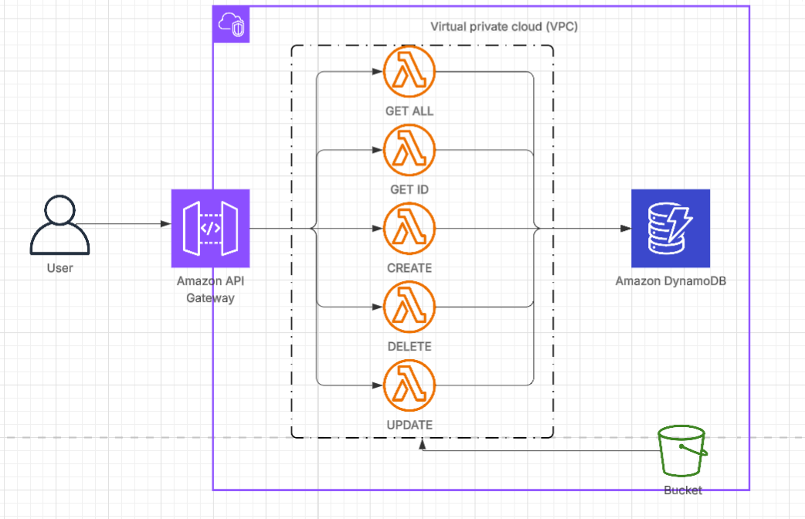

# ☁️ PRÁCTICA ENTREGABLE: DISEÑO DE APLICACIONES EN LA NUBE

Este repositorio contiene la aplicación desarrollada para la Práctica Obligatoria 1 de Computación en la Nube, cubriendo dos arquitecturas de despliegue:

- La versión monolítica acoplada, diseñada para ser desplegada en la arquitectura AWS ECS Fargate + API Gateway + NLB.

- Versión desacoplada basada en el patrón CRUD Puro, implementada como cinco funciones AWS Lambda (una por operación CRUD), con el código almacenado en un bucket de S3 y expuestas a través de API Gateway..

## 📋 Esquema de las Arquitecturas de Despliegue
La principal diferencia radica en cómo se gestionan la lógica de la aplicación y la exposición de los endpoints.

### 1️⃣ Versión Monolítica Acoplada (ECS Fargate) 🐋
Esta arquitectura sigue el patrón de microservicios sobre contenedores, donde el servicio está siempre activo.



### 2️⃣ Versión Desacoplada / Serverless (AWS Lambda) ⚡
Esta arquitectura es completamente serverless y de pago por uso, descomponiendo la aplicación por función (CRUD Puro).



## 📂 Estructura Completa del Proyecto y Propósito

Esta tabla combina la vista general con la descripción detallada de los directorios específicos de cada arquitectura.

| Directorio / Archivo | Contenido Principal | Propósito |
| :--- | :--- | :--- |
| **`backend/`** | Capa de Acceso a Datos (Patrón Repository). | Gestiona toda la lógica de la aplicación y la comunicación con la base de datos (DynamoDB).
| **`frontend/`** | Código de la Interfaz de Usuario. |Provee una interfaz HTML básica para la interacción del usuario con la API. |
| **`dynamodb/`** | Plantilla CloudFormation para la creación de la tabla DynamoDB. | Define la infraestructura necesaria para almacenar los datos de la aplicación, creando una tabla Characters con clave primaria character_id y facturación bajo demanda. |
| **`model/`** | Definición de Entidades/Objetos. | Define la estructura de los datos clave de la aplicación (el objeto Character). |
| **`test/`** | Herramientas y Scripts de Pruebas. | Permite verificar la funcionalidad de la API (colección Postman y tests automáticos CRUD). |
| **`venv/`** | Entorno de Ejecución. | Contiene el entorno virtual de Python para aislar las dependencias del proyecto. |
| **`acoplada/`** | Versión Monolítica del Código.  | Implementa la lógica en un servicio único listo para el despliegue en AWS ECS Fargate. |
| **`desacoplada/`** | Versión Distribuida (Lambda). | Implementa la lógica dividida en cinco funciones AWS Lambda para un despliegue desacoplado. |


### 1️⃣ Versión Monolítica Acoplada (ECS Fargate) - Detalle

| Directorio / Archivo | Contenido Principal | Propósito |
|:---|:---|:---|
| **`acoplada/app/`** | Lógica Monolítica (`app_backend.py`). | Contiene el código completo del servidor, que expone los 5 endpoints CRUD en una única aplicación. |
| **`acoplada/config/`** | Plantillas de CloudFormation (`ecs.yml`, `ecr.yml`, `ecs-params.json`). | Define toda la infraestructura AWS ECS (ECS, NLB, API Gateway) y el repositorio ECR. |
| **`acoplada/requirements_acoplada.txt`** | Dependencias de Python. | Lista las librerías necesarias para ejecutar la aplicación acoplada (incluyendo el framework web). |
| **`Dockerfile`** | Configuración de la imagen Docker. | Se utiliza en la versión acoplada para crear la imagen desplegable en AWS ECS Fargate. |

---

### 2️⃣ Versión CRUD Puro Desacoplada (AWS Lambda) - Detalle

| Directorio / Archivo | Contenido Principal | Propósito |
|:---|:---|:---|
| **`desacoplada/app/`** | Handlers de las 5 funciones Lambda. | Contiene los puntos de entrada individuales (`create_handler.py`, `delete_handler.py`, etc.), uno por cada operación CRUD. |
| **`desacoplada/config/`** | Plantilla de CloudFormation (`lambdas.yml`) y archivo de parámetros (`lambdas-params.json`). | Define la infraestructura Serverless (5 Lambdas, API Gateway e integraciones). |
| **`desacoplada/requirements_desacoplada.txt`** | Dependencias de Python. | Lista las librerías esenciales para las funciones Lambda (`boto3`, `pydantic`). |
| **`charaters_lambda_package.zip/`** | Paquete del código y dependencias. | Se usa en la versión desacoplada, cargado en un bucket S3 para las funciones AWS Lambda. |
---

## ⚙️ Proceso de Despliegue Detallado Versión Acoplada (AWS CLI)

### 0️⃣: Prerrequisitos y Configuración Inicial

  1.  **Verificación de Archivos:** Confirme que `bd_dynamodb.yml`, `ecr.yml`, `ecs.yml`, `Dockerfile` y `ecs-params.json` están actualizados y son correctos.

  2.  **Configuración de AWS CLI:** Obtenga las credenciales temporales (`aws_access_key_id`, `aws_secret_access_key`, `aws_session_token`) y configure la CLI.
      ```bash
      aws configure
      export REGION='{TU_REGION}'
      export ACCOUNT_ID='{TU_ID_DE_CUENTA_AWS}'
      aws sts get-caller-identity # Comprobación de la autenticación
      ```

  3.  **Docker Desktop:** Asegúrese de que Docker Desktop está en ejecución para la fase de contenedorización.

### 1️⃣: Base de Datos (DynamoDB)

1.  **Desplegar la Pila de BDD (CloudFormation):**

    ```bash
    aws cloudformation create-stack 
      --stack-name bdd-stack-p1 
      --template-body file://acoplada/config/bd_dynamodb.yml
      --region $REGION 
    aws cloudformation wait stack-create-complete --stack-name bdd-stack-p1 --region $REGION
    ```

2.  **Obtener el Nombre de la Tabla:** (Actualizar `ecs-params.json` con este valor).

    ```bash
    aws cloudformation describe-stacks 
      --stack-name bdd-stack-p1 
      --query "Stacks[0].Outputs[?OutputKey=='TableName'].OutputValue" 
      --output text
    ```

### 2️⃣: Contenedorización y Registro (ECR)

1.  **Crear el Repositorio ECR:**
    
    ```bash
    aws cloudformation create-stack 
    --stack-name ecr-stack-p1 
    --template-body file://acoplada/config/ecr.yml 
    --region $REGION
    aws cloudformation wait stack-create-complete --stack-name ecr-stack-p1 --region $REGION
    ```

2. **Obtener la URI de ECR y exportar la variable:**

    ```bash
    export ECR_URI="$ACCOUNT_ID.dkr.ecr.$[REGION.amazonaws.com/characters-app](https://REGION.amazonaws.com/characters-app)"
    ```

3.  **Login en ECR:**
    ```bash
    aws ecr get-login-password --region $REGION | docker login --username AWS --password-stdin $ECR_URI
    ```

4.  **Construir y Subir la Imagen:**

    *(IMPORTANTE: Asegúrese de que Docker Desktop esté corriendo.)*

    ```bash
    docker build -t characters-app .
    docker tag characters-app:latest $ECR_URI:latest
    docker push $ECR_URI:latest
    ```

### 3️⃣: Despliegue de Infraestructura y Servicios (ECS & API Gateway)

Despliegue de los recursos de computación (ECS Fargate), balanceo de carga (NLB) y la capa de exposición pública (API Gateway, VPC Link).

1.  **Desplegar la Pila Completa (CloudFormation):**

    ```bash
    aws cloudformation create-stack 
      --stack-name ecs-stack-p1 
      --template-body file://acoplada/config/ecs.yml 
      --parameters file://acoplada/config/ecs-params.json 
      --region $REGION 
    aws cloudformation wait stack-create-complete --stack-name ECS-Stack-P1 --region $REGION
    ```

2.  **Obtener los Endpoints de Acceso (Outputs):**

    2.1. **URL Base de la API Gateway:** (URL pública para testing)

      ```bash
      aws cloudformation describe-stacks 
        --stack-name ecs-stack-p1 
        --query "Stacks[0].Outputs[?OutputKey=='CharacterApiUrl'].OutputValue"
        --output text
      ```

    2.2. **ID de la API Key:** (Necesario para obtener el valor secreto en la Consola)

      ```bash
      aws cloudformation describe-stacks 
        --stack-name ecs-stack-p1 
        --query "Stacks[0].Outputs[?OutputKey=='ApiKeyId'].OutputValue" 
        --output text
      ```

    2.3. **Valor secreto de la API Key:** (x-api-key)

      ```bash
      aws apigateway get-api-key
      --api-key a1b2c3d4e5
      --include-value
      --query 'value'
      --output text
      ```

    2.4. **DNS del Load Balancer (Interno):** (Para verificación interna, opcional)

        ```bash
        aws cloudformation describe-stacks 
          --stack-name ecs-stack-p1 
          --query "Stacks[0].Outputs[?OutputKey=='CharacterNlbDnsName'].OutputValue" 
          --output text
        ```

### 4️⃣: Limpieza de Recursos

1.  **Eliminar la Pila Principal (ECS/NLB/APIGW):**

    ```bash
    aws cloudformation delete-stack --stack-name ECS-Stack-P1 --region $REGION
    aws cloudformation wait stack-delete-complete --stack-name ECS-Stack-P1 --region $REGION
    ```

2.  **Eliminar la Pila de la Base de Datos (DynamoDB):**

    ```bash
    aws cloudformation delete-stack --stack-name BDD-Stack-P1 --region $REGION
    aws cloudformation wait stack-delete-complete --stack-name BDD-Stack-P1 --region $REGION
    ```

3.  **Vaciar y Eliminar el Repositorio ECR:**

    ```bash
    # Eliminar todas las imágenes
    aws ecr batch-delete-image \
        --repository-name characters-app \
        --image-ids "$(aws ecr list-images --repository-name characters-app --query 'imageIds[*]' --output json --region $REGION)" \
        --region $REGION || true
    # Eliminar el repositorio
    aws cloudformation delete-stack --stack-name ECR-Stack-P1 --region $REGION
    aws cloudformation wait stack-delete-complete --stack-name ECR-Stack-P1 --region $REGION
    ```

4.  **Verificación Final:** Confirme que no quedan stacks activos en CloudFormation.

    ```bash
    aws cloudformation list-stacks --stack-status-filter CREATE_COMPLETE UPDATE_COMPLETE --region $REGION
    ```

## ⚙️ Proceso de Despliegue Detallado Versión Serverless (AWS CLI)

El despliegue se centra en tres fases: Base de Datos, ECR/Contenedor y, finalmente, las Lambdas/API Gateway.

### 0️⃣: Prerrequisitos y Configuración Inicial

  1. **Verificación de Archivos:** Confirme que lambdas.yaml y el paquete ZIP con el código de su Lambda están listos.

  2.  **Configuración de AWS CLI:** Configure la CLI con sus credenciales.

    ```bash
    aws configure
    export REGION='{TU_REGION}'
    export ACCOUNT_ID='{TU_ID_DE_CUENTA_AWS}'
    aws sts get-caller-identity # Comprobación de la autenticación
    ```
    
  3. **Variables de S3:** Defina el nombre del bucket S3 donde se alojará el código de la Lambda.

    ```bash
    export S3_BUCKET_NAME='{TU_NOMBRE_DE_BUCKET_UNICO}'
    export S3_KEY='lambdas-code/version-desacoplada.zip' # Ruta dentro del bucket
    ```

### 1️⃣: Base de Datos (DynamoDB)

1.  **Desplegar la Pila de BDD (CloudFormation):**

    ```bash
    aws cloudformation create-stack 
      --stack-name bdd-stack-p1 
      --template-body file://dynamodb/bd_dynamodb.yml 
      --region $REGION 
    aws cloudformation wait stack-create-complete --stack-name bdd-stack-p1 --region $REGION
    ```

2.  **Obtener el Nombre de la Tabla:**

    ```bash
    aws cloudformation describe-stacks
      --stack-name bdd-stack-p1
      --query "Stacks[0].Outputs[?OutputKey=='TableName'].OutputValue"
      --output text
    ```

### 2️⃣: Paquetes de Código (S3)

1.  **Crear el Bucket S3 (si no existe):**

    ```bash
    aws s3 mb s3://$S3_BUCKET_NAME --region $REGION
    ```

2.  **Subir el Paquete ZIP de la Lambda:**

    ```bash
    aws s3 cp ./characters_lambda_package.zip s3://$S3_BUCKET_NAME/$S3_KEY --region $REGION
    ```

### 3️⃣: Despliegue de Infraestructura Serverless (Lambda & API Gateway)

  1.  **Desplegar la Pila Completa (CloudFormation):**

    ```bash
    aws cloudformation create-stack 
      --stack-name serverless-crud-stack 
      --template-body file://desacoplada/config/lambdas.yml 
      --parameter-overrides file://lambdas-params.json  
      --region $REGION \
      --capabilities CAPABILITY_NAMED_IAM
    aws cloudformation wait stack-create-complete --stack-name serverless-crud-stack --region $REGION
    ```

    *(Nota: `CAPABILITY_NAMED_IAM` es necesario porque la pila crea roles/permisos Lambda.)*

  2.  **Obtener los Endpoints de Acceso (Outputs):**

    2.1. **URL Base de la API Gateway:** (URL pública para testing)

      ```bash
      aws cloudformation describe-stacks \
        --stack-name serverless-crud-stack \
        --query "Stacks[0].Outputs[?OutputKey=='CharacterApiUrl'].OutputValue" \
        --output text
      ```

    2.2. **Valor secreto de la API Key:** (Necesario para el header `x-api-key`)

      ```bash
      # 1. Obtener el ID de la API Key (Output: ApiKeyId)
      API_KEY_ID=$(aws cloudformation describe-stacks \
        --stack-name serverless-crud-stack \
        --query "Stacks[0].Outputs[?OutputKey=='ApiKeyId'].OutputValue" \
        --output text)
      # 2. Obtener el valor de la clave usando el ID
      aws apigateway get-api-key \
        --api-key $API_KEY_ID \
        --include-value \
        --query 'value' \
        --output text
      ```

### 4️⃣: Limpieza de Recursos

  1.  **Eliminar la Pila Principal (Lambdas/APIGW):**

    ```bash
    aws cloudformation delete-stack --stack-name serverless-crud-stack --region $REGION
    aws cloudformation wait stack-delete-complete --stack-name serverless-crud-stack --region $REGION
    ```

  2.  **Eliminar la Pila de la Base de Datos (DynamoDB):**

    ```bash
    aws cloudformation delete-stack --stack-name bdd-stack-p1 --region $REGION
    aws cloudformation wait stack-delete-complete --stack-name bdd-stack-p1 --region $REGION
    ```

  3.  **Vaciar y Eliminar el Bucket S3 (Opcional):**

    ```bash
    aws s3 rm s3://$S3_BUCKET_NAME --recursive --region $REGION
    aws s3 rb s3://$S3_BUCKET_NAME --force --region $REGION
    ```

4.  **Verificación Final:** Confirme que no quedan stacks activos en CloudFormation.

    ```bash
    aws cloudformation list-stacks --stack-status-filter CREATE_COMPLETE UPDATE_COMPLETE --region $REGION
    ```

## 🔍: Pruebas Funcionales (CRUD)
 
### 1️⃣. Pruebas Automáticas (Python)
  - Ejecute la prueba automática incluida en el script `test/test_api_cycle.py` para verificar los 5 endpoints establecidos de manera secuencial.

### 2️⃣ Pruebas Manuales (Postman/Interfaz)

  - Colección Postman: Importe la colección `postman.json` a Postman. Configure la variable {{ApiBaseUrl}} con el valor de su CharacterApiUrl e incluya el valor secreto de la API Key en el header x-api-key para todas las operaciones.
  - Interfaz Gráfica: Use la interfaz frontend/frontend.html para probar la API a través de una aplicación web simple.

## 💰 Análisis del Costo

  ### 1️⃣ Versión Monolítica Acoplada (ECS Fargate) - Estimación de Costos Mensuales y Anuales

  | Servicio | Descripción | Costo mensual estimado | Costo anual estimado |
  | :--- | :--- | ---: | ---: |
  | **Amazon DynamoDB (On-Demand)** | Almacén NoSQL para los personajes, con modo pago por solicitud para 100 mil lecturas y escrituras. | USD 0.02 | USD 0.24 |
  | **Amazon ECR (Elastic Container Registry)** | Almacenamiento de las imágenes Docker del servicio de Characters, unos 0.65 GB por mes debido a las dos imágenes de Docker que almacena. | USD 0.07 | USD 0.84 |
  | **Amazon ECS (Fargate)** | Ejecución del contenedor con 2 tareas activas (0.25 vCPU, 0.5 GB RAM). | USD  9.01 | USD 108.12 |
  | **Amazon API Gateway (REST API)** | Interfaz de acceso HTTP a la API Characters. Costos por llamadas (100 mil llamadas ≈ USD 3.50). | USD 0.35 | USD 4.20 |
  | **AWS Network Load Balancer (NLB)** | Balanceo interno del tráfico entre tareas ECS. | USD 16.47 | USD 197.64 |
  | **Total estimado** | Se ha considerado un entorno de desarrollo o de bajo tráfico | **USD 25.87** | **USD 310.47** |

  ### 2️⃣ Versión Desacoplada / Serverless (Lambdas) – Estimación de Costos Mensuales y Anuales

  | Servicio | Descripción | Costo mensual estimado | Costo anual estimado |
  | :--- | :--- | ---: | ---: |
  | **Amazon DynamoDB (On-Demand)** | Almacén NoSQL para los personajes, con modo pago por solicitud para 100 mil lecturas y escrituras. | USD 0.02 | USD 0.24 |
  | **Amazon S3** | Almacenamiento del paquete de despliegue Lambda (~50 MB). | USD 0.02 | USD 0.24 |
  | **AWS Lambda** | Ejecución del contenedor con 1 tarea activa (0.25 vCPU, 0.5 GB RAM). | USD 0.01 | USD 0.12 |
  | **Amazon API Gateway (REST API)** | Interfaz de acceso HTTP a la API Characters. Costos por llamadas (100 mil llamadas ≈ USD 3.50). | USD 0.35 | USD 4.20 |
  | **Total estimado** | Se ha considerado un entorno de desarrollo o de bajo tráfico | **USD 0.45** | **USD 5.45** |
  